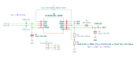

Battery Buck-Boost DC/DC Converter PCB
======================================

Overview
--------

PCB to convert DC/DC from 2-3 AA/AAA batteries to a range of voltages.

Dimensions: 15mm W × 12mm H

Purpose
-------

Fix devices that don't handle the full range of voltages on rechargable
batteries by converting 2-3 AA/AAA batteries to a configurable fixed
output voltage with a low quiescent current.

Usage
-----

This is a KiCad project. Select one of the R1 resistor values to change
the output voltage.

Schematics
----------

PCB
---

Components
----------

+---------------------+----------+---------------------------------------------------------------+
| Refs                | Quantity | Name                                                          |
+=====================+==========+===============================================================+
| C1                  |     1    | 2.2µF 10V X5R Capacitor, SMD 0805 (Metric 2012)               |
+---------------------+----------+---------------------------------------------------------------+
| C2                  |     1    | 10µF 10V X5R Capacitor, SMD 0805 (Metric 2012)                |
+---------------------+----------+---------------------------------------------------------------+
| D1                  |     1    | Schottky Diode, SMD 0805 (Metric 2012)                        |
+---------------------+----------+---------------------------------------------------------------+
| J1                  |     1    | 1x03 Pin Header, Through Hole (2.54mm)                        |
+---------------------+----------+---------------------------------------------------------------+
| L1                  |     1    | 10µH 500mA 300mΩ Inductor, SMD 0805 (Metric 2012)             |
+---------------------+----------+---------------------------------------------------------------+
| R1 (3.3V)           |     1    | 390kΩ 0.1% 125mW Resistor, SMD 0805 (Metric 2012)             |
+---------------------+----------+---------------------------------------------------------------+
| R1 (4.0V)           |     1    | 442kΩ 0.1% 125mW Resistor, SMD 0805 (Metric 2012)             |
+---------------------+----------+---------------------------------------------------------------+
| R1 (4.5V)           |     1    | 374kΩ 0.1% 125mW Resistor, SMD 0805 (Metric 2012)             |
+---------------------+----------+---------------------------------------------------------------+
| R1 (5.0V)           |     1    | 324kΩ 0.1% 125mW Resistor, SMD 0805 (Metric 2012)             |
+---------------------+----------+---------------------------------------------------------------+
| R2                  |     1    | 1MΩ 0.1% 125mW Resistor, SMD 0805 (Metric 2012)               |
+---------------------+----------+---------------------------------------------------------------+
| U1                  |     1    | LTC3531EDD 200mA Synchronous Buck-Boost DC/DC Converter, SMD  |
+---------------------+----------+---------------------------------------------------------------+
